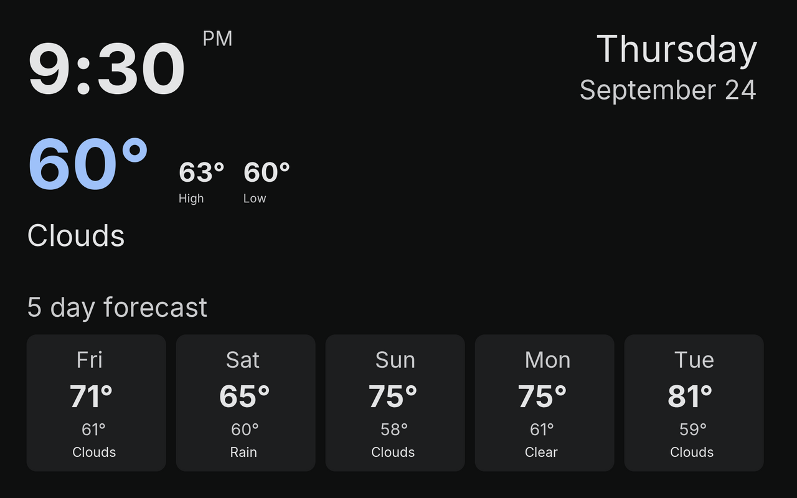

# Andscreen

A 2013 Nexus 7 was sitting in a drawer, getting very good at collecting dust. Buying a wall display on Amazon would have worked, and would also have cost money. Pairing a microcontroller with a panel would have meant a weekend of pinouts, a parts order, and the strong chance of owning one more half-finished gadget. The tablet already had a decent 1920×1200 screen, Wi-Fi, and a touch layer. Android 6 is old enough that the fashionable toolkits have left the building, so this is a small Java app and a Go server on the same network.

The tablet shows whatever picture the server is currently willing to hand out. Touch that picture and the tablet tells the server about it. USB is only how the app gets installed. After that, the cable can go back in the drawer with whatever else lives there.

This is an actual frame from the server, the same 1920×1200 picture the tablet draws, scaled down so it fits the page.



The tablet is a Nexus 7 (`flo`), Android 6.0.1, API 23, landscape. The app is `com.andscreen`, built without Gradle from the Ubuntu Android packages (`android-sdk`, `android-sdk-platform-23`, `dalvik-exchange`, `openjdk-17-jdk`). The server is the Go 1.25 module `github.com/mlctrez/andscreen`. It paints the frame offscreen with `github.com/gogpu/ui` v0.1.54 and reads Fahrenheit weather from `github.com/briandowns/openweathermap` v0.21.1.

One URL does both jobs. `GET` is the picture. `POST` is the touches.

## Tablet

The picture fills the screen, and the status and navigation bars stay out of the way. From 9:00 AM until 10:00 PM the panel sits at half brightness. At 10 it drops to 0, which is as close as this thing gets to looking asleep while the app is still running. At 9 the next morning it comes back to half. The app handles that on its own.

The server address stays off the screen during normal use. The first launch asks for it and will not continue until one is saved. After that, hold volume-down for about two seconds to open the same dialog. The key is eaten, so the volume does not actually change, which is what you want on a thing hanging on a wall. Save stores the address and closes the dialog. Back, or a tap outside, keeps the address already in use. It is remembered across launches. A bare `host:port` is stored as `http://host:port`.

The only extra text is a line along the bottom when something is wrong. `Cannot reach server` means just that, and it goes away when an image loads again. `Server has no image yet` is what you get when `GET` returns 404.

Touches are in the coordinate space of the drawn image. `x` and `y` are fractions of that image, so the letterbox bars do not count. A finger that slides off the picture can report values outside 0–1. `px` and `py` are pixels in the view.

When the picture changes, a vertical seam can flash for a frame. `ImageScreen` is an ordinary `View`. It draws the bitmap in `onDraw` and recycles the previous one immediately, which the old Adreno chip sometimes catches mid-sample.

## Image updates

Each served image has a generation number. `GET` sends it as an `ETag`, a quoted integer such as `"3"`.

Once the tablet is sitting there with a picture, it asks again about once a second. The request carries `If-None-Match` with the `ETag` it already has. `304` means nothing changed, so the screen is left alone. `200` means the generation moved, and the new body replaces the picture. The one-second gap is measured from the previous `GET`. The network loop wakes about every 50 ms, so the poll lands near that one-second mark without a separate timer.

A touch `POST` comes back as JSON:

```json
{"generation": 3}
```

The tablet compares that number with the picture on screen.

*   A different number means fetch now, in the same loop, as soon as the `POST` response has been read. It does not sit around for the next idle poll.
*   The same number means the picture on screen is still the one the server is serving. Leave it, and go back to the one-second poll.

That is how a touch that takes a while to produce an image still updates the tablet when the image is actually finished.

The server is allowed to answer the `POST` immediately with whatever generation is on screen, and do the work afterward. The tablet keeps the old picture. When the finished image replaces the one being served, the generation goes up. The next idle `GET` sees the new `ETag`, so the screen catches up within about a second of the image being ready.

The `POST` can also wait until the new image is the one `GET` will return, and only then answer with that new generation. The tablet fetches as soon as it reads the response.

One background thread does all of the network work. It will not start a `GET` while a `POST` is still open, so the one-second poll cannot sneak in and grab a half-finished image. A render that takes several seconds just pauses the poll. Touches that arrive during the wait are kept, as described under Touch request. If the response generation is new, the tablet loads that image before it sends the touches that were waiting.

The tablet gives up on a response after 20 seconds. Hold a `POST` longer than that and the bottom line says `Cannot reach server`, then it tries again about a second later. If the generation did move before the timeout, that retry still loads the finished image.

Bump the generation only when the bytes `GET` will return are the image that should be shown. A `POST` that advertises a new generation before those bytes are ready makes the tablet fetch the old picture again.

## Touch request

`POST` body:

```json
{
  "events": [
    {
      "t_ms": 10,
      "action": "down",
      "id": 0,
      "x": 0.5,
      "y": 0.25,
      "px": 960,
      "py": 300,
      "view_w": 1920,
      "view_h": 1200
    }
  ]
}
```

`action` is `down`, `move`, `up`, or `cancel`. `id` is the pointer. `down` is the press. Moves come along too, so a server can follow a drag if it wants to.

Touches that happen while a request is in flight are queued. A normal burst of downs, moves, and ups is kept. The network thread takes up to 200 waiting events into the `POST` it is sending. Anything that arrives after that stays in the queue. When the in-flight `POST` returns, the thread finishes the image fetch if the generation changed or the one-second poll is due, then sends the leftovers in later batches of up to 200.

If input arrives faster than it can be sent, the queue keeps the newest events. Past 500 waiting events, each new one drops the oldest. Events already copied into the `POST` on the wire are gone if that request fails. Events still waiting are kept and sent after the one-second pause that follows `Cannot reach server`. Saving a new server address clears the queue.

## This server

With no image arguments, the server draws one 1920×1200 time and temperature screen.

```bash
cd server
go run ./cmd/andscreen
```

It listens on `LISTEN`, or `:8080` when that variable is empty. The clock, weekday, and date are the machine's local time. The frame is redrawn at the start of each minute, which bumps the generation, and the tablet's idle poll picks it up.

The layout, in `server/internal/app/timetemp.go`, is dark Material:

*   Upper left: the time at 168px, with a smaller AM/PM beside it.
*   Upper right: the weekday at 88px, then the date at 64px.
*   Big number on the left: the current temperature at 168px.
*   To its right, smaller and on one line: today's high and today's low at 64px. An 83px spacer shoves that pair down toward the baseline of the big number. In this version of `gogpu/ui`, an `HBox` ignores cross-axis alignment, so the spacer is the hack that makes it look intentional.
*   Under that: the condition word only, such as `Clouds` or `Clear`, at 72px.
*   Heading `5 day forecast` at 64px.
*   Five day tiles. The weekday is 54px. Each tile has a high, a low, and a condition.

`DrawText` draws one line and does not clip, so a long string runs through its neighbor. Keep each string short enough for its column. `primitives.Image` paints a placeholder instead of the bitmap, which is a fun surprise. The old sample screens in `server/internal/app/screens.go` get around that with `placedImage`. The time screen does not use it.

Until a weather fetch succeeds, those readings are an em dash. Today's high is the max of the current temperature and today's forecast `temp_max`. Today's low is the min of the current temperature and today's `temp_min`. Each later day's condition is the forecast slot whose hour is closest to 3 PM local. A missing condition stays an em dash.

Weather needs `OWM_KEY` and `OWM_ZIP`. For development, `github.com/joho/godotenv` loads a `.env` from the working directory. A variable already set in the process is left alone. A missing `.env` is fine, and `server/.env` is gitignored. `server/.env.sample` lists the names. The key stays out of the log.

A fetch runs on the half hour from 6:00 AM through 11:00 PM. Outside that window, and between those half hours, the last reading stays on screen. A failed fetch waits until the next half hour instead of hammering the API every minute. The 5-day forecast only has slots from now forward, so late in the day today's high can miss a peak that already happened.

A press is logged with the pointer and where it landed. The time screen stays up. Poking the forecast does not do anything yet, besides prove the touch arrived.

`go test ./...` covers the HTTP generation rules, the minute changing the image, the 6:00–23:00 window, and forecast aggregation. It does not call OpenWeatherMap. `go test -tags live -run TestLiveWeatherPreview` does call the API and writes `server/time-temp.png`, which is gitignored.

`server/cmd/andscreen` is the command. The screen, the HTTP hub, the weather fetch, and start/stop live in `server/internal/app`.

## Service

The process runs under [`github.com/mlctrez/servicego`](https://github.com/mlctrez/servicego). `cmd/andscreen` calls `servicego.Run`, which parses `-action`.

`Start` loads a working-directory `.env` when one is present, draws the first frame, binds the listen address, and returns while the HTTP server and the minute loop keep going. `Stop` cancels that loop and shuts the listener down.

With no arguments the process runs in the foreground, the same as `-action run`. `-action` also accepts `install`, `uninstall`, `start`, `stop`, `restart`, and `deploy`.

The listen address is `LISTEN` from the environment or `.env`. Empty means `:8080`.

An installed unit uses working directory `/opt/servicego/<executable name>` and reads `/etc/sysconfig/<executable name>`. Name the binary `andscreen` so the unit, the directory, and the sysconfig file all match. `OWM_KEY`, `OWM_ZIP`, and `LISTEN` belong in that file. Run `go run` from `server/` when you want the development `.env` to load.

```bash
cd server
go build -o andscreen ./cmd/andscreen
```

## Build and install

From the repo root, `make` builds the APK and the server binary. `make android` and `make server` build one of them. `make deploy-apk` installs the APK on the attached Nexus 7 and starts the app again, which matters because installing otherwise just kills whatever was on the screen. The adb serial is one line in `.tablet` at the repo root, and that file is gitignored. `make deploy` copies the server to dune and installs it there. The server binary is written to `/tmp/andscreen`.

```bash
make
make deploy-apk
cd server && go test ./...
cd server && go run ./cmd/andscreen
```

The debug key is `android/debug.keystore`, also gitignored, so a later install replaces this app instead of fighting it. The APK is signed with signature scheme v1, which Android 6 still insists on. The Java stays free of lambdas and method references so the bytecode is Java 8. The tablet is not interested in newer ideas.

## Layout

| Path | Role |
|---|---|
| `Makefile` | Builds the APK and the server. `make deploy-apk` installs and starts the app. `make deploy` installs the server on dune |
| `android/build.sh` | `aapt`, `javac --release 8`, `dalvik-exchange`, `zipalign`, `apksigner` |
| `android/src/com/andscreen/MainActivity.java` | Fullscreen activity, address dialog, volume-down hold, brightness |
| `android/src/com/andscreen/ImageScreen.java` | Bitmap view and touch mapping |
| `android/src/com/andscreen/NetClient.java` | GET/POST loop, queue, 20s timeout |
| `server/cmd/andscreen/main.go` | Hands the process to `servicego` |
| `server/internal/app/service.go` | Start/stop, HTTP server, minute loop |
| `server/internal/app/hub.go` | HTTP, generation, press log |
| `server/internal/app/timetemp.go` | Layout and the minute / weather schedule |
| `server/internal/app/weather.go` | OpenWeatherMap fetch and daily high/low |
| `server/internal/app/screens.go` | Older sample screens, plus `placedImage` for bitmaps the toolkit will not draw |
| `server/.env.sample` | `OWM_KEY`, `OWM_ZIP`, and `LISTEN` |
